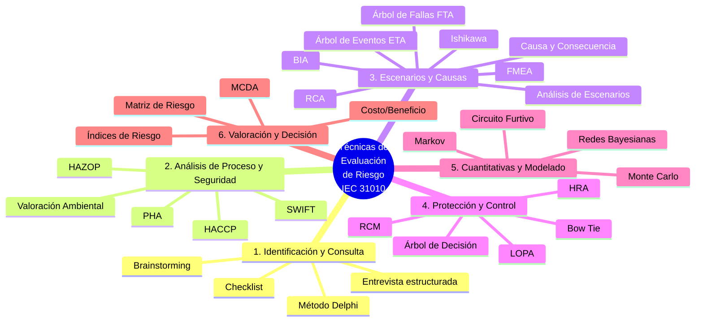
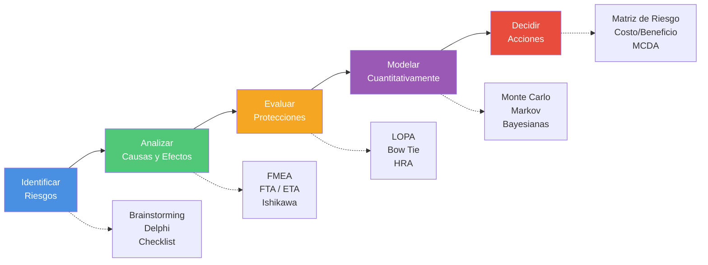
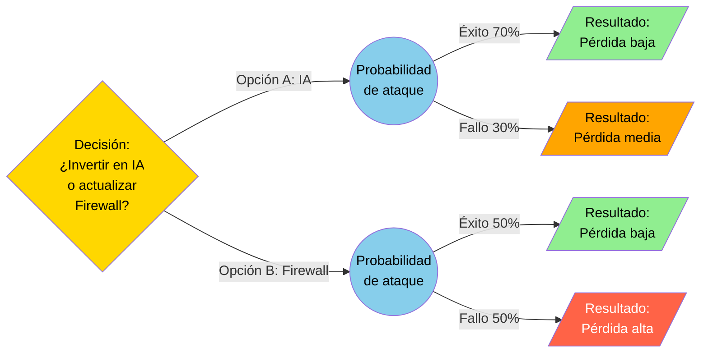
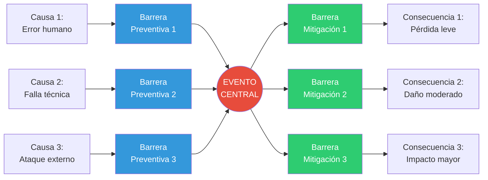
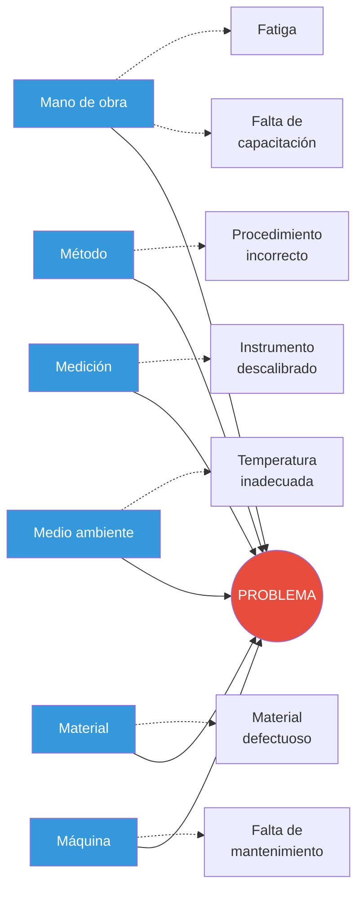
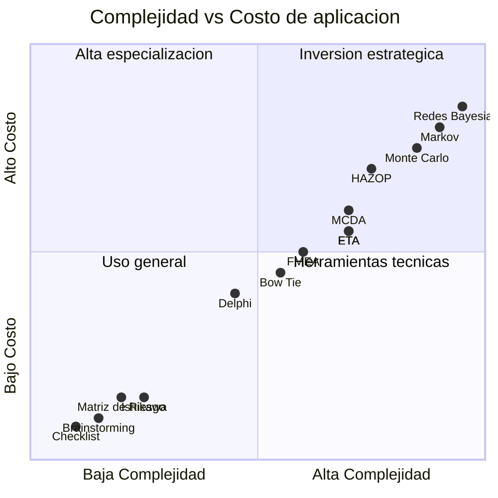

# *GLOSARIO DE TÉCNICAS DE EVALUACIÓN DE RIESGO* *TIPOS DE TÉCNICAS*

##### Mayor (EJC) Miguel Angel Villanueva Naranjo.
##### Mayor (EJC) Cristian Andres Sanchez Baron.
##### Mayor (FAC) Erika Lissett Colorado Snachez. 
##### Capitan Corbeta. Andrés Ricardo Pedraza Leguizamón.
##### Capitán Corbeta. Leonardo Rodríguez Robles.

## Actividad:

Gestión del Riesgo

Escuela Superior de Guerra “General Rafael Reyes Prieto”

Bogotá D.C., Colombia

2026

# *GLOSARIO DE TÉCNICAS DE EVALUACIÓN DE RIESGO*

## *TIPOS DE TÉCNICAS*

Este es un glosario técnico de las técnicas de valoración del riesgo, las cuales se encuentran detalladas en la norma IEC 31010, que complementa a la ISO 31000. Estas herramientas se dividen según su propósito: identificación, análisis o evaluación.

## *1. Técnicas de Identificación y Consulta*

*Lluvia de ideas (Brainstorming):* Técnica grupal para generar una gran cantidad de ideas o identificar riesgos potenciales en poco tiempo, fomentando la participación abierta y sin juicios iniciales.

*Entrevista estructurada:* Método de recolección de datos donde el entrevistador sigue un guion de preguntas predefinidas para obtener información específica de expertos o partes interesadas.

*Delphi:* Proceso iterativo para obtener un consenso entre un panel de expertos independientes de forma anónima, evitando que una opinión dominante influya en las demás.

*Lista de verificación (Checklist):* Herramienta simple que utiliza un listado de riesgos o fallas históricas para asegurar que no se omitan elementos comunes durante la identificación.

## *2. Técnicas de Análisis de Riesgos de Proceso y Seguridad*

*Análisis Primario de Peligros (PHA):* Método de análisis inicial (generalmente en la fase de diseño) para identificar peligros, situaciones peligrosas y eventos que podrían causar daño en un sistema.

*Estudio de Peligros y Operatividad (HAZOP):* Técnica sistemática que utiliza "palabras guía" (ej. No, Más, Menos) para identificar desviaciones en el diseño de un proceso industrial que puedan generar riesgos.

*Análisis de Peligros y Puntos Críticos de Control (HACCP):* Sistema proactivo utilizado principalmente en la industria alimentaria y farmacéutica para identificar peligros específicos y establecer medidas para su control en puntos críticos de la cadena.

*Valoración del Riesgo Ambiental:* Proceso para estimar la probabilidad y magnitud de los efectos adversos que pueden sufrir los ecosistemas debido a la exposición a uno o más agentes contaminantes o actividades humanas.

*Estructura "¿Qué pasa si?" (SWIFT):* Técnica de identificación de riesgos sistemática, basada en equipos, que utiliza frases disparadoras tipo "Qué pasaría si..." para explorar desviaciones del funcionamiento normal.

## *3. Técnicas de Análisis de Escenarios y Causas*

*Análisis de Escenarios:* Técnica que describe posibles situaciones futuras de forma descriptiva, permitiendo evaluar las consecuencias de diferentes combinaciones de eventos y riesgos.

*Análisis de Impacto al Negocio (BIA):* Proceso para determinar el efecto que tendría la interrupción de actividades críticas en la organización, estableciendo tiempos máximos de recuperación.

*Análisis de Causa Raíz (RCA):* Metodología para investigar incidentes ya ocurridos con el fin de identificar la causa original (raíz) y evitar su repetición.

*Análisis de Modo y Efecto de Falla (EMEF/FMEA):* Técnica que identifica cómo puede fallar un componente o proceso, evaluando la severidad, ocurrencia y detección de dicha falla.

*Análisis de Árbol de Fallas (FTA):* Técnica deductiva (de arriba hacia abajo) que parte de un evento no deseado y analiza todas las combinaciones de fallas que podrían causarlo usando lógica booleana.

*Análisis de Árbol de Eventos (ETA):* Técnica inductiva (de abajo hacia arriba) que parte de un evento iniciador y explora las diversas trayectorias posibles según funcionen o fallen los sistemas de protección.

*Análisis de Causa y Consecuencia:* Combinación de los árboles de fallas y eventos para visualizar el camino completo desde la causa básica hasta el impacto final.

*Análisis de Causa / Efecto (Ishikawa/Espina de Pescado):* Herramienta gráfica que organiza las posibles causas de un problema en categorías (Mano de obra, Método, Máquina, etc.).

## *4. Técnicas de Protección y Control*

*Análisis de Capas de Protección (LOPA):* Método que evalúa si existen suficientes "capas" (barreras) de seguridad para reducir el riesgo de un evento accidental a un nivel aceptable.

*Análisis de esquema de Corbatín (Bow Tie):* Diagrama que combina las causas (izquierda) y las consecuencias (derecha) de un evento central, mostrando las barreras de prevención y de mitigación.

*Análisis de Confiabilidad Humana (HRA):* Evalúa la probabilidad de que ocurran errores humanos y su impacto en el desempeño de un sistema técnico.

*Mantenimiento enfocado en la Confiabilidad (RCM):* Proceso para determinar los requerimientos de mantenimiento de los activos físicos en su contexto de operación para que sigan cumpliendo sus funciones.

## *5. Técnicas Cuantitativas y Modelado*

*Análisis de Circuito Furtivo (Sneak Circuit):* Técnica para identificar condiciones en un sistema eléctrico o de software que permiten que ocurran funciones no deseadas sin que exista una falla de componente.

*Análisis de Markov:* Modelo matemático utilizado para predecir la probabilidad de que un sistema se encuentre en un estado determinado (ej. operativo, fallido, en reparación) a lo largo del tiempo.

*Simulación Monte Carlo:* Técnica computacional que utiliza muestreo aleatorio repetido para obtener distribuciones de resultados posibles en situaciones de alta incertidumbre.

*Redes Bayesianas:* Modelos gráficos que representan relaciones de dependencia probabilística entre variables, muy útiles para actualizar riesgos cuando aparece nueva información.

## *6. Técnicas de Valoración y Decisión*

*Índices de Riesgo:* Valores numéricos calculados mediante fórmulas que permiten clasificar y priorizar riesgos de forma rápida, aunque a veces subjetiva.

*Matriz de Consecuencia y Probabilidad (Matriz de Riesgo):* Herramienta visual que cruza la gravedad de un impacto con su frecuencia de ocurrencia para categorizar el nivel de riesgo (Bajo, Medio, Alto).

*Análisis Costo / Beneficio:* Evaluación financiera que compara los costos de implementar un control contra los beneficios esperados (reducción del riesgo) para decidir si la inversión es viable.

*Análisis de Decisión por Criterios Múltiples (MCDA):* Metodología que permite comparar diferentes opciones basándose en múltiples criterios (ej. costo, seguridad, tiempo, reputación) que a menudo están en conflicto.

# Gráfica de Técnicas de Evaluación de Riesgo (IEC 31010)
 
## Mapa general de clasificación
 

 
## Flujo del proceso de gestión de riesgo
 

 
## Estructura de un Árbol de Decisión (ejemplo gráfico)
 

 
## Diagrama Bow Tie (Corbatín)
 

 
## Diagrama Ishikawa (Espina de Pescado)
 

 
## Matriz de Riesgo (Consecuencia vs Probabilidad)
 
| Probabilidad \ Impacto | **Insignificante** | **Menor** | **Moderado** | **Mayor** | **Catastrófico** |
|---|---|---|---|---|---|
| **Casi seguro** | Medio | Alto | Alto | Extremo | Extremo |
| **Probable** | Medio | Medio | Alto | Alto | Extremo |
| **Posible** | Bajo | Medio | Medio | Alto | Extremo |
| **Improbable** | Bajo | Bajo | Medio | Medio | Alto |
| **Raro** | Bajo | Bajo | Bajo | Medio | Alto |
 
**Leyenda:**
- **Bajo**: Riesgo aceptable, monitoreo rutinario.
- **Medio**: Requiere controles adicionales.
- **Alto**: Atención prioritaria, plan de acción.
- **Extremo**: Intervención inmediata, revisión de la alta dirección.
## Comparación rápida por técnica
 

 
---