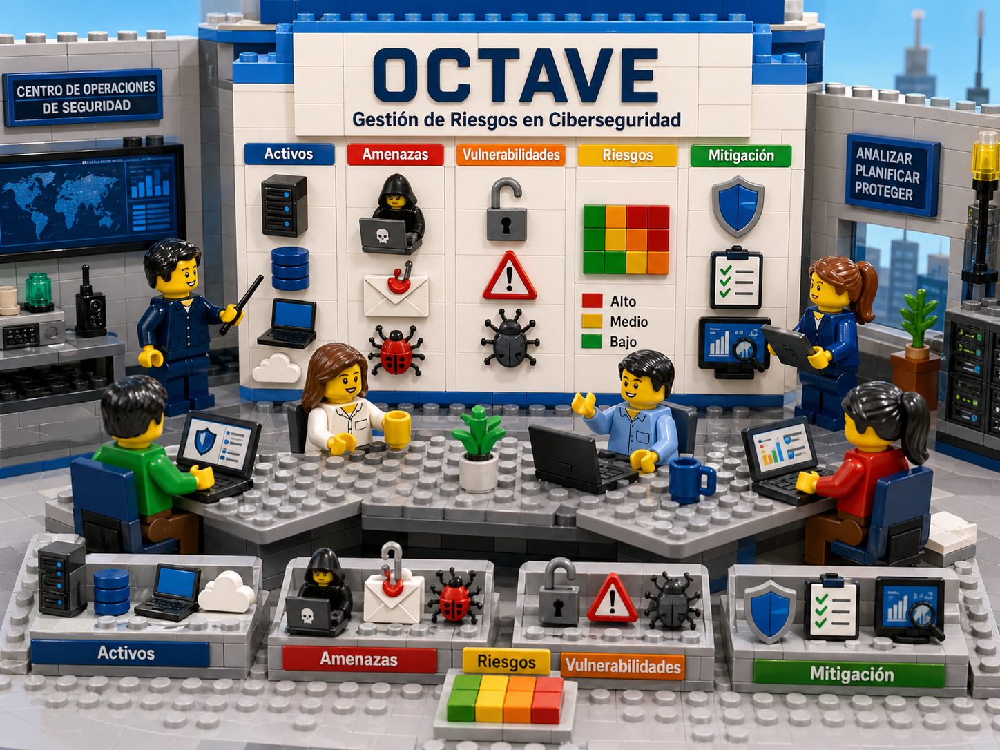

# OCTAVE **GESTIÓN DEL RIESGO CIBERNÉTICO**
## 1. ¿Qué es OCTAVE?

**OCTAVE** significa **Operationally Critical Threat, Asset, and Vulnerability Evaluation**, es decir, **Evaluación de amenazas, activos y vulnerabilidades operacionalmente críticos**. Es una metodología de evaluación de riesgos de seguridad de la información desarrollada por el **Software Engineering Institute, SEI, de Carnegie Mellon University**. Su propósito es ayudar a una organización a identificar activos críticos, analizar amenazas, evaluar vulnerabilidades y priorizar planes de mitigación basados en el impacto para el negocio. ([sei.cmu.edu][1])

A diferencia de enfoques puramente técnicos, OCTAVE se centra en el **riesgo organizacional**: combina personas, procesos, tecnología, información, servicios, instalaciones y objetivos de negocio. En su versión **OCTAVE Allegro**, el enfoque se orienta principalmente a los **activos de información** y al contexto en el que se almacenan, procesan, transportan y usan. ([sei.cmu.edu][1])

---

## 2. Objetivos

1. Identificar activos críticos de información.
2. Definir criterios de impacto.
3. Construir perfiles de activos.
4. Identificar amenazas y escenarios de riesgo.
5. Evaluar impactos y probabilidades.
6. Priorizar riesgos.
7. Definir estrategias de mitigación.
8. Elaborar un plan de tratamiento de riesgos.

---

## 3. Versiones principales de OCTAVE

### 3.1 OCTAVE original

El modelo OCTAVE original fue diseñado para organizaciones grandes, con estructuras jerárquicas complejas y múltiples áreas de negocio. Trabaja mediante fases orientadas a la visión organizacional, la visión tecnológica y el análisis de riesgos. ([PECB][2])

### 3.2 OCTAVE-S

**OCTAVE-S** fue pensado para organizaciones pequeñas. ENISA describe que OCTAVE-S suele ser liderado por un equipo interdisciplinario pequeño, normalmente de tres a cinco personas, que recopila y analiza información para producir una estrategia de protección y planes de mitigación. ([ENISA][3])

### 3.3 OCTAVE Allegro

**OCTAVE Allegro** es una versión más ligera y práctica. Fue publicada por CERT/SEI para optimizar el proceso de evaluación de riesgos de seguridad de la información, reduciendo esfuerzo y recursos necesarios. Incluye guías, hojas de trabajo y ejemplos para realizar evaluaciones de riesgos. ([sei.cmu.edu][1])

En estaguía se refiere principalmente **OCTAVE Allegro**, porque es más aplicable a evaluaciones modernas de ciberseguridad.

---

# 4. Principios básicos de OCTAVE

## 4.1 El riesgo se analiza desde el negocio

OCTAVE no empieza preguntando “¿qué firewall tenemos?”, sino:

**¿Qué información es crítica para la organización y qué pasaría si se pierde su confidencialidad, integridad o disponibilidad?**

Ejemplo:

| Activo de información        | Riesgo principal               | Impacto de negocio                                |
| ---------------------------- | ------------------------------ | ------------------------------------------------- |
| Base de datos de clientes    | Filtración de datos personales | Multas, pérdida de confianza, daño reputacional   |
| Sistema de facturación       | Interrupción del servicio      | Pérdida de ingresos                               |
| Repositorio de código fuente | Robo de propiedad intelectual  | Ventaja para competidores, exposición de secretos |
| Correos ejecutivos           | Compromiso de cuentas          | Fraude, phishing interno, fuga de información     |

---

## 4.2 Se priorizan activos críticos

No todos los activos merecen el mismo nivel de análisis. OCTAVE propone concentrarse en aquellos activos cuya pérdida afectaría gravemente los objetivos de negocio.

Ejemplo:

Una impresora de oficina puede ser un activo tecnológico, pero quizá no sea tan crítica como el sistema que almacena historiales médicos, expedientes financieros o credenciales de usuarios.

---

## 4.3 Se consideran personas, procesos y tecnología

Un riesgo de ciberseguridad no siempre nace de una falla técnica. Puede surgir por:

* Falta de capacitación.
* Procesos manuales inseguros.
* Contraseñas compartidas.
* Mala gestión de proveedores.
* Sistemas sin parches.
* Configuraciones incorrectas.
* Falta de monitoreo.
* Ausencia de respaldos.

---

# 5. Estructura general de OCTAVE Allegro

OCTAVE Allegro se organiza comúnmente en **8 pasos** agrupados en áreas como criterios de medición, perfil de activos, identificación de amenazas, análisis y mitigación. La documentación de SEI/CERT incluye guías, cuestionarios y hojas de trabajo para aplicar estos pasos. ([sei.cmu.edu][1])

Los 8 pasos prácticos son:

1. Establecer criterios de medición del riesgo.
2. Desarrollar el perfil de activos de información.
3. Identificar contenedores de activos.
4. Identificar áreas de preocupación.
5. Identificar escenarios de amenaza.
6. Identificar riesgos.
7. Analizar riesgos.
8. Seleccionar estrategias de mitigación.

---

# 6. Paso 1: Establecer criterios de medición del riesgo

## 6.1 Objetivo

Definir cómo la organización medirá el impacto de un riesgo. Antes de evaluar riesgos, hay que decidir qué significa “alto”, “medio” o “bajo”.

## 6.2 Criterios recomendados

Puedes usar estos criterios:

| Criterio              | Pregunta clave                                                |
| --------------------- | ------------------------------------------------------------- |
| Reputación            | ¿El incidente afectaría la imagen pública?                    |
| Financiero            | ¿Generaría pérdidas económicas?                               |
| Legal/regulatorio     | ¿Provocaría multas, demandas o incumplimientos?               |
| Operacional           | ¿Interrumpiría procesos críticos?                             |
| Seguridad de personas | ¿Podría afectar la integridad física de empleados o clientes? |
| Productividad         | ¿Reduciría la capacidad de trabajo?                           |
| Confidencialidad      | ¿Expondría información sensible?                              |
| Integridad            | ¿Alteraría información crítica?                               |
| Disponibilidad        | ¿Impediría acceder a sistemas o datos?                        |

## 6.3 Escala sugerida

| Nivel       | Descripción                                        |
| ----------- | -------------------------------------------------- |
| 1 - Bajo    | Impacto mínimo, recuperable rápidamente            |
| 2 - Medio   | Impacto moderado, requiere intervención            |
| 3 - Alto    | Impacto grave, afecta operaciones o cumplimiento   |
| 4 - Crítico | Impacto severo, compromete continuidad del negocio |

## 6.4 Ejemplo

**Criterio: impacto financiero**

| Nivel   | Definición                             |
| ------- | -------------------------------------- |
| Bajo    | Pérdida menor a USD 1.000              |
| Medio   | Pérdida entre USD 1.000 y USD 10.000   |
| Alto    | Pérdida entre USD 10.000 y USD 100.000 |
| Crítico | Pérdida superior a USD 100.000         |

---

# 7. Paso 2: Desarrollar perfiles de activos de información

## 7.1 Objetivo

Crear una descripción detallada de cada activo crítico de información.

## 7.2 ¿Qué es un activo de información?

Es cualquier dato o conjunto de información con valor para la organización.

Ejemplos:

* Datos personales de clientes.
* Credenciales de acceso.
* Información financiera.
* Código fuente.
* Contratos.
* Diseños técnicos.
* Logs de seguridad.
* Expedientes médicos.
* Bases de datos de empleados.
* Documentos legales.

## 7.3 Plantilla de perfil de activo

| Campo                    | Descripción                          |
| ------------------------ | ------------------------------------ |
| Nombre del activo        | Identificación clara                 |
| Propietario              | Área o persona responsable           |
| Usuarios autorizados     | Quién puede acceder                  |
| Ubicación                | Dónde se almacena                    |
| Formato                  | Digital, físico, base de datos, nube |
| Confidencialidad         | Alta, media, baja                    |
| Integridad               | Alta, media, baja                    |
| Disponibilidad           | Alta, media, baja                    |
| Requisitos legales       | Normas aplicables                    |
| Valor para el negocio    | Por qué es importante                |
| Consecuencias de pérdida | Qué pasaría si se compromete         |

## 7.4 Ejemplo

| Campo                 | Ejemplo                                           |
| --------------------- | ------------------------------------------------- |
| Nombre del activo     | Base de datos de clientes                         |
| Propietario           | Gerencia Comercial / TI                           |
| Usuarios autorizados  | Ventas, soporte, marketing, administradores de BD |
| Ubicación             | Servidor cloud, región us-east                    |
| Formato               | Base de datos PostgreSQL                          |
| Confidencialidad      | Alta                                              |
| Integridad            | Alta                                              |
| Disponibilidad        | Alta                                              |
| Requisitos legales    | Protección de datos personales                    |
| Valor para el negocio | Permite ventas, soporte y facturación             |
| Consecuencias         | Multas, pérdida de clientes, daño reputacional    |

---

# 8. Paso 3: Identificar contenedores de activos

## 8.1 Objetivo

Determinar dónde vive, se procesa, se transmite o se almacena el activo de información.

En OCTAVE Allegro, los activos se analizan en su contexto: dónde se usan, almacenan, transportan y procesan. ([cio-wiki.org][4])

## 8.2 Tipos de contenedores

| Tipo de contenedor | Ejemplos                                           |
| ------------------ | -------------------------------------------------- |
| Técnico            | Servidores, bases de datos, laptops, SaaS, APIs    |
| Físico             | Archivadores, oficinas, centros de datos           |
| Humano             | Empleados, proveedores, administradores            |
| Externo            | Cloud providers, terceros, integraciones, clientes |

## 8.3 Ejemplo

Activo: **Base de datos de clientes**

| Contenedor             | Tipo            | Riesgo potencial                            |
| ---------------------- | --------------- | ------------------------------------------- |
| Servidor cloud         | Técnico         | Acceso no autorizado por mala configuración |
| CRM SaaS               | Técnico externo | Exposición por integración insegura         |
| Equipo de soporte      | Humano          | Uso indebido de datos                       |
| Backups                | Técnico         | Copias sin cifrado                          |
| Proveedor de marketing | Externo         | Tratamiento no autorizado de datos          |

---

# 9. Paso 4: Identificar áreas de preocupación

## 9.1 Objetivo

Detectar situaciones que podrían afectar negativamente el activo.

Una **área de preocupación** no es todavía un riesgo completo; es una alerta preliminar.

## 9.2 Ejemplos de áreas de preocupación

Para la base de datos de clientes:

* Los administradores usan cuentas compartidas.
* Los backups no están cifrados.
* El acceso remoto no exige MFA.
* El proveedor externo accede a datos sin contrato claro.
* No hay monitoreo de consultas masivas.
* La base de datos está expuesta a internet.
* No existe plan probado de recuperación.

---

# 10. Paso 5: Identificar escenarios de amenaza

## 10.1 Objetivo

Convertir áreas de preocupación en escenarios concretos de amenaza.

Un escenario de amenaza describe:

1. Actor.
2. Motivo.
3. Medio.
4. Activo afectado.
5. Resultado.
6. Impacto.

## 10.2 Tipos de actores

| Actor               | Ejemplo                                           |
| ------------------- | ------------------------------------------------- |
| Interno accidental  | Empleado que borra información por error          |
| Interno malicioso   | Administrador que extrae datos                    |
| Externo oportunista | Atacante automatizado                             |
| Externo dirigido    | Grupo que apunta específicamente a la empresa     |
| Proveedor           | Tercero con acceso excesivo                       |
| Malware             | Ransomware, spyware, troyanos                     |
| Error técnico       | Falla de configuración o actualización defectuosa |

## 10.3 Plantilla de escenario

| Elemento  | Descripción             |
| --------- | ----------------------- |
| Activo    | Información afectada    |
| Actor     | Quién causa el evento   |
| Acceso    | Cómo llega al activo    |
| Acción    | Qué hace                |
| Resultado | Qué se compromete       |
| Impacto   | Consecuencia de negocio |

## 10.4 Ejemplo

| Elemento  | Ejemplo                                               |
| --------- | ----------------------------------------------------- |
| Activo    | Base de datos de clientes                             |
| Actor     | Atacante externo                                      |
| Acceso    | Explota credenciales filtradas sin MFA                |
| Acción    | Extrae registros personales                           |
| Resultado | Pérdida de confidencialidad                           |
| Impacto   | Multas, pérdida reputacional, notificación a clientes |

---

# 11. Paso 6: Identificar riesgos

## 11.1 Objetivo

Formalizar el riesgo combinando amenaza, vulnerabilidad, activo e impacto.

## 11.2 Fórmula conceptual

**Riesgo = Amenaza × Vulnerabilidad × Impacto**

En ciberseguridad, también se suele considerar la probabilidad:

**Nivel de riesgo = Probabilidad × Impacto**

## 11.3 Ejemplo de riesgo

| Elemento       | Descripción                                |
| -------------- | ------------------------------------------ |
| Activo         | Base de datos de clientes                  |
| Amenaza        | Robo de información                        |
| Vulnerabilidad | Falta de MFA y credenciales reutilizadas   |
| Evento         | Atacante accede al panel de administración |
| Impacto        | Exposición de datos personales             |
| Riesgo         | Alto                                       |

---

# 12. Paso 7: Analizar riesgos

## 12.1 Objetivo

Asignar niveles de impacto y probabilidad para priorizar.

## 12.2 Escala de probabilidad

| Nivel        | Descripción                          |
| ------------ | ------------------------------------ |
| 1 - Baja     | Poco probable, controles sólidos     |
| 2 - Media    | Podría ocurrir, controles parciales  |
| 3 - Alta     | Probable, vulnerabilidades conocidas |
| 4 - Muy alta | Inminente o ya observado             |

## 12.3 Matriz de riesgo

| Impacto / Probabilidad | Baja 1 | Media 2 | Alta 3 | Muy alta 4 |
| ---------------------- | -----: | ------: | -----: | ---------: |
| Bajo 1                 |      1 |       2 |      3 |          4 |
| Medio 2                |      2 |       4 |      6 |          8 |
| Alto 3                 |      3 |       6 |      9 |         12 |
| Crítico 4              |      4 |       8 |     12 |         16 |

## 12.4 Clasificación

| Puntaje | Nivel   |
| ------: | ------- |
|   1 - 3 | Bajo    |
|   4 - 6 | Medio   |
|   8 - 9 | Alto    |
| 12 - 16 | Crítico |

## 12.5 Ejemplo

Riesgo: **Acceso no autorizado a base de datos de clientes**

| Factor       | Valor       |
| ------------ | ----------- |
| Probabilidad | Alta = 3    |
| Impacto      | Crítico = 4 |
| Puntaje      | 3 × 4 = 12  |
| Nivel        | Crítico     |

---

# 13. Paso 8: Seleccionar estrategias de mitigación

## 13.1 Objetivo

Decidir qué hacer con cada riesgo.

## 13.2 Opciones de tratamiento

| Estrategia | Descripción                         | Ejemplo                   |
| ---------- | ----------------------------------- | ------------------------- |
| Mitigar    | Reducir probabilidad o impacto      | Implementar MFA           |
| Transferir | Pasar parte del riesgo a un tercero | Ciberseguro               |
| Aceptar    | Asumir el riesgo                    | Riesgo bajo documentado   |
| Evitar     | Eliminar la actividad riesgosa      | Retirar sistema obsoleto  |
| Compartir  | Gestionarlo con otra parte          | Contratos con proveedores |

## 13.3 Plan de mitigación

| Campo           | Descripción                        |
| --------------- | ---------------------------------- |
| Riesgo          | Riesgo identificado                |
| Nivel           | Bajo, medio, alto, crítico         |
| Acción          | Control propuesto                  |
| Responsable     | Dueño de la acción                 |
| Fecha objetivo  | Plazo                              |
| Costo estimado  | Recursos requeridos                |
| Estado          | Pendiente, en curso, completado    |
| Riesgo residual | Nivel esperado después del control |

---

# 14. Caso práctico completo: empresa de comercio electrónico

## 14.1 Contexto

Una empresa de comercio electrónico vende productos en línea. Maneja:

* Datos personales de clientes.
* Datos de pedidos.
* Integraciones con pasarela de pagos.
* Panel administrativo.
* Repositorio de código.
* Infraestructura cloud.
* Servicio de atención al cliente.

El objetivo es aplicar OCTAVE para evaluar riesgos de ciberseguridad.

---

## 14.2 Activo crítico 1: Base de datos de clientes

### Perfil del activo

| Campo            | Valor                                       |
| ---------------- | ------------------------------------------- |
| Activo           | Base de datos de clientes                   |
| Propietario      | Director de Tecnología                      |
| Usuarios         | Soporte, ventas, administradores            |
| Confidencialidad | Alta                                        |
| Integridad       | Alta                                        |
| Disponibilidad   | Alta                                        |
| Ubicación        | Cloud database                              |
| Valor            | Permite ventas, soporte y gestión comercial |

### Contenedores

| Contenedor                   | Tipo    |
| ---------------------------- | ------- |
| Base de datos cloud          | Técnico |
| CRM                          | Técnico |
| Backups                      | Técnico |
| Equipo de soporte            | Humano  |
| Proveedor de email marketing | Externo |

### Áreas de preocupación

* No todos los usuarios tienen MFA.
* El acceso administrativo no está segmentado.
* Los backups no están cifrados.
* El proveedor de marketing recibe datos por archivos CSV.
* No hay alertas por exportaciones masivas.

### Escenario de amenaza

Un atacante obtiene credenciales de un empleado mediante phishing. Como no hay MFA, ingresa al CRM y exporta datos personales de clientes.

### Riesgo

| Elemento       | Evaluación                      |
| -------------- | ------------------------------- |
| Amenaza        | Phishing y robo de credenciales |
| Vulnerabilidad | Falta de MFA                    |
| Impacto        | Crítico                         |
| Probabilidad   | Alta                            |
| Puntaje        | 12                              |
| Nivel          | Crítico                         |

### Controles recomendados

| Control                           | Tipo           |
| --------------------------------- | -------------- |
| MFA obligatorio                   | Preventivo     |
| Principio de mínimo privilegio    | Preventivo     |
| Alertas por exportaciones masivas | Detectivo      |
| Cifrado de backups                | Preventivo     |
| Revisión periódica de accesos     | Administrativo |
| Capacitación anti-phishing        | Administrativo |
| Registro y monitoreo SIEM         | Detectivo      |

### Riesgo residual esperado

Después de aplicar MFA, monitoreo y revisión de permisos, la probabilidad podría bajar de **alta** a **media**, reduciendo el riesgo de **crítico** a **alto o medio**, según la efectividad de los controles.

---

## 14.3 Activo crítico 2: Plataforma web de ventas

### Perfil del activo

| Campo            | Valor                       |
| ---------------- | --------------------------- |
| Activo           | Plataforma web              |
| Propietario      | Gerencia Digital            |
| Confidencialidad | Media                       |
| Integridad       | Alta                        |
| Disponibilidad   | Crítica                     |
| Valor            | Canal principal de ingresos |

### Áreas de preocupación

* Dependencias sin actualizar.
* Falta de pruebas de seguridad en despliegues.
* No existe WAF configurado correctamente.
* El pipeline CI/CD usa secretos en texto plano.
* No hay pruebas periódicas de recuperación.

### Escenario de amenaza

Un atacante explota una vulnerabilidad en una dependencia del backend y logra ejecutar código remoto.

### Riesgo

| Elemento       | Evaluación                        |
| -------------- | --------------------------------- |
| Amenaza        | Explotación de vulnerabilidad web |
| Vulnerabilidad | Dependencias desactualizadas      |
| Impacto        | Alto                              |
| Probabilidad   | Alta                              |
| Puntaje        | 9                                 |
| Nivel          | Alto                              |

### Controles recomendados

| Control                 | Descripción                           |
| ----------------------- | ------------------------------------- |
| SAST                    | Análisis estático del código          |
| DAST                    | Pruebas dinámicas sobre la aplicación |
| SCA                     | Análisis de dependencias vulnerables  |
| WAF                     | Protección contra ataques web comunes |
| Gestión de parches      | Actualización sistemática             |
| Secret scanning         | Detección de secretos en repositorios |
| Hardening de servidores | Configuración segura                  |
| Pentesting periódico    | Validación ofensiva controlada        |

---

## 14.4 Activo crítico 3: Repositorio de código fuente

### Perfil del activo

| Campo            | Valor                                        |
| ---------------- | -------------------------------------------- |
| Activo           | Código fuente                                |
| Propietario      | Líder de Desarrollo                          |
| Confidencialidad | Alta                                         |
| Integridad       | Alta                                         |
| Disponibilidad   | Media                                        |
| Valor            | Propiedad intelectual y base de la operación |

### Áreas de preocupación

* Desarrolladores con permisos excesivos.
* Repositorios antiguos sin revisión.
* Secrets expuestos en commits.
* Falta de firma de commits.
* No hay revisión obligatoria de pull requests.

### Escenario de amenaza

Un atacante compromete la cuenta de un desarrollador e inserta código malicioso en una rama principal.

### Riesgo

| Elemento       | Evaluación                                |
| -------------- | ----------------------------------------- |
| Amenaza        | Compromiso de cuenta de desarrollador     |
| Vulnerabilidad | Sin MFA fuerte y sin revisión obligatoria |
| Impacto        | Crítico                                   |
| Probabilidad   | Media                                     |
| Puntaje        | 8                                         |
| Nivel          | Alto                                      |

### Controles recomendados

| Control                           | Descripción                    |
| --------------------------------- | ------------------------------ |
| MFA obligatorio en plataforma Git | Reduce compromiso de cuentas   |
| Protección de ramas               | Evita cambios directos         |
| Revisión de código obligatoria    | Control de integridad          |
| Secret scanning                   | Detecta claves expuestas       |
| CI/CD con controles de seguridad  | Previene despliegues inseguros |
| SBOM                              | Inventario de componentes      |
| Firma de commits                  | Mejora trazabilidad            |

---

# 15. Registro de riesgos ejemplo

| ID    | Activo               | Riesgo                                | Prob. | Impacto | Nivel   | Tratamiento          | Responsable     |
| ----- | -------------------- | ------------------------------------- | ----: | ------: | ------- | -------------------- | --------------- |
| R-001 | BD clientes          | Robo de datos por phishing            |     3 |       4 | Crítico | Mitigar              | CISO / TI       |
| R-002 | Web ecommerce        | Explotación de dependencia vulnerable |     3 |       3 | Alto    | Mitigar              | DevSecOps       |
| R-003 | Código fuente        | Inserción de código malicioso         |     2 |       4 | Alto    | Mitigar              | Líder Dev       |
| R-004 | Backups              | Pérdida de backups por ransomware     |     2 |       4 | Alto    | Mitigar              | Infraestructura |
| R-005 | Proveedor marketing  | Uso indebido de datos                 |     2 |       3 | Medio   | Transferir / mitigar | Legal / Compras |
| R-006 | Correos corporativos | BEC o fraude por suplantación         |     3 |       3 | Alto    | Mitigar              | Seguridad       |

---

# 16. Ejemplo de plan de mitigación

## Riesgo R-001: Robo de datos por phishing

| Elemento        | Detalle                                          |
| --------------- | ------------------------------------------------ |
| Riesgo          | Acceso no autorizado a datos de clientes         |
| Nivel inicial   | Crítico                                          |
| Controles       | MFA, monitoreo, capacitación, mínimo privilegio  |
| Responsable     | CISO                                             |
| Plazo           | 60 días                                          |
| Evidencia       | Reporte de MFA, logs SIEM, actas de capacitación |
| Riesgo residual | Medio                                            |
| Indicador       | 100% de usuarios críticos con MFA                |

## Riesgo R-002: Explotación de dependencia vulnerable

| Elemento        | Detalle                                                 |
| --------------- | ------------------------------------------------------- |
| Riesgo          | Ataque a la aplicación web                              |
| Nivel inicial   | Alto                                                    |
| Controles       | SCA, parches, WAF, pruebas DAST                         |
| Responsable     | DevSecOps                                               |
| Plazo           | 45 días                                                 |
| Evidencia       | Reportes SCA, pipeline CI/CD, reglas WAF                |
| Riesgo residual | Medio                                                   |
| Indicador       | Vulnerabilidades críticas corregidas en menos de 7 días |

---

# 17. Roles y responsabilidades

| Rol                             | Responsabilidades                         |
| ------------------------------- | ----------------------------------------- |
| Alta dirección                  | Aprobar criterios de riesgo y presupuesto |
| CISO / Responsable de seguridad | Liderar la evaluación                     |
| Dueño del activo                | Validar criticidad e impacto              |
| TI / Infraestructura            | Identificar vulnerabilidades técnicas     |
| Desarrollo                      | Corregir riesgos de aplicaciones          |
| Legal / Cumplimiento            | Evaluar obligaciones regulatorias         |
| Recursos Humanos                | Apoyar capacitación y gestión de personal |
| Proveedores                     | Cumplir controles contractuales           |
| Auditoría interna               | Verificar cumplimiento y evidencias       |

---

# 18. Evidencias que debe producir una evaluación OCTAVE

Una evaluación bien ejecutada debería generar:

1. Lista de activos críticos.
2. Perfiles de activos.
3. Mapa de contenedores.
4. Áreas de preocupación.
5. Escenarios de amenaza.
6. Registro de riesgos.
7. Matriz de priorización.
8. Plan de tratamiento.
9. Responsables y fechas.
10. Evidencias de implementación.
11. Riesgo residual.
12. Reporte ejecutivo.

---

# 19. Plantillas reutilizables

## 19.1 Plantilla de activo

| Campo                       | Valor |
| --------------------------- | ----- |
| Nombre del activo           |       |
| Descripción                 |       |
| Propietario                 |       |
| Usuarios autorizados        |       |
| Ubicación                   |       |
| Contenedores                |       |
| Confidencialidad            |       |
| Integridad                  |       |
| Disponibilidad              |       |
| Requisitos legales          |       |
| Valor para el negocio       |       |
| Consecuencias de compromiso |       |

## 19.2 Plantilla de amenaza

| Campo                    | Valor |
| ------------------------ | ----- |
| Activo afectado          |       |
| Actor de amenaza         |       |
| Motivación               |       |
| Método de ataque         |       |
| Vulnerabilidad explotada |       |
| Resultado esperado       |       |
| Impacto                  |       |
| Controles existentes     |       |

## 19.3 Plantilla de riesgo

| Campo            | Valor |
| ---------------- | ----- |
| ID del riesgo    |       |
| Activo           |       |
| Amenaza          |       |
| Vulnerabilidad   |       |
| Evento de riesgo |       |
| Consecuencia     |       |
| Probabilidad     |       |
| Impacto          |       |
| Nivel de riesgo  |       |
| Tratamiento      |       |
| Responsable      |       |
| Fecha objetivo   |       |
| Riesgo residual  |       |

## 19.4 Plantilla de plan de tratamiento

| Campo               | Valor                               |
| ------------------- | ----------------------------------- |
| Riesgo              |                                     |
| Control propuesto   |                                     |
| Tipo de control     | Preventivo / Detectivo / Correctivo |
| Responsable         |                                     |
| Recursos necesarios |                                     |
| Fecha inicio        |                                     |
| Fecha fin           |                                     |
| Métrica de éxito    |                                     |
| Evidencia           |                                     |
| Estado              |                                     |

---

# 20. Controles típicos de ciberseguridad asociados a OCTAVE

| Riesgo identificado       | Controles recomendados                             |
| ------------------------- | -------------------------------------------------- |
| Phishing                  | MFA, capacitación, filtrado de correo, DMARC       |
| Ransomware                | Backups offline, EDR, segmentación, parches        |
| Fuga de datos             | DLP, cifrado, clasificación de información         |
| Acceso indebido           | IAM, mínimo privilegio, revisiones de acceso       |
| Vulnerabilidades web      | SAST, DAST, WAF, pentesting                        |
| Mala configuración cloud  | CSPM, hardening, revisión de IAM                   |
| Exposición de secretos    | Secret scanning, vault, rotación de claves         |
| Riesgo de proveedores     | Evaluación de terceros, cláusulas contractuales    |
| Pérdida de disponibilidad | Alta disponibilidad, DRP, BCP                      |
| Alteración de datos       | Control de cambios, logs, integridad criptográfica |

---

# 21. Indicadores de gestión

Para medir la efectividad del programa OCTAVE, se pueden usar indicadores como:

| Indicador                          | Ejemplo                                          |
| ---------------------------------- | ------------------------------------------------ |
| Riesgos críticos abiertos          | Número de riesgos críticos sin tratamiento       |
| Tiempo medio de mitigación         | Días promedio para cerrar riesgos                |
| Cobertura MFA                      | Porcentaje de usuarios críticos con MFA          |
| Vulnerabilidades críticas vencidas | Cantidad fuera de SLA                            |
| Activos con perfil actualizado     | Porcentaje de activos críticos documentados      |
| Proveedores evaluados              | Porcentaje de terceros con revisión de seguridad |
| Pruebas de recuperación exitosas   | Porcentaje de restauraciones probadas            |
| Incidentes repetidos               | Eventos que reaparecen por falta de control      |

---

# 22. Recomendaciones para aplicar OCTAVE correctamente

## 22.1 Involucrar áreas de negocio

OCTAVE pierde valor si lo ejecuta solo el área técnica. Los dueños de procesos deben participar porque ellos conocen el verdadero impacto del riesgo.

## 22.2 Empezar con pocos activos

No intentes evaluar todo al mismo tiempo. Comienza con 5 a 10 activos críticos.

## 22.3 Usar lenguaje de negocio

Evita expresar riesgos solo como “CVE crítica” o “puerto abierto”. Traduce a impacto:

> “Un atacante podría explotar una vulnerabilidad en el portal web y detener las ventas durante varias horas.”

## 22.4 Documentar el riesgo residual

Después de aplicar controles, siempre queda algún nivel de riesgo. Ese riesgo debe ser aceptado formalmente por la autoridad correspondiente.

## 22.5 Revisar periódicamente

La evaluación OCTAVE no debe ser única. Debe repetirse cuando haya:

* Nuevos sistemas.
* Nuevos proveedores.
* Cambios regulatorios.
* Incidentes de seguridad.
* Migraciones cloud.
* Nuevos productos digitales.
* Cambios organizacionales.

---

# 23. Ventajas de OCTAVE

| Ventaja                 | Descripción                                        |
| ----------------------- | -------------------------------------------------- |
| Enfoque organizacional  | Conecta seguridad con objetivos de negocio         |
| Priorización clara      | Ayuda a concentrar recursos en activos críticos    |
| Participativo           | Involucra áreas técnicas y no técnicas             |
| Flexible                | Puede adaptarse a empresas grandes o pequeñas      |
| Centrado en información | Especialmente en OCTAVE Allegro                    |
| Útil para SGSI          | Puede apoyar programas de seguridad tipo ISO 27001 |

---

# 24. Limitaciones de OCTAVE

| Limitación                         | Cómo gestionarla                                  |
| ---------------------------------- | ------------------------------------------------- |
| Puede generar mucha documentación  | Usar plantillas simples y herramientas GRC        |
| Requiere participación del negocio | Conseguir patrocinio de dirección                 |
| Puede ser subjetivo                | Definir escalas claras de impacto y probabilidad  |
| No reemplaza pruebas técnicas      | Complementar con pentesting, escaneo y auditorías |
| Puede quedar desactualizado        | Revisar periódicamente                            |

---

# 25. Ejemplo final resumido

## Escenario

Una clínica almacena historiales médicos en una plataforma cloud.

## Aplicación OCTAVE

| Paso            | Resultado                                                  |
| --------------- | ---------------------------------------------------------- |
| Criterios       | Legal, reputacional, disponibilidad, confidencialidad      |
| Activo          | Historias clínicas digitales                               |
| Contenedores    | Plataforma cloud, laptops médicas, backups, proveedor SaaS |
| Preocupación    | Acceso remoto sin MFA                                      |
| Amenaza         | Robo de credenciales por phishing                          |
| Riesgo          | Exposición de datos médicos                                |
| Probabilidad    | Alta                                                       |
| Impacto         | Crítico                                                    |
| Nivel           | Crítico                                                    |
| Mitigación      | MFA, cifrado, monitoreo, capacitación, revisión de accesos |
| Riesgo residual | Medio                                                      |

## Redacción formal del riesgo

> Existe el riesgo de que un atacante externo obtenga credenciales de un médico mediante phishing y acceda al sistema de historias clínicas debido a la ausencia de MFA, comprometiendo la confidencialidad de datos sensibles de pacientes y generando consecuencias legales, reputacionales y operativas críticas.

---

# 26. Conclusión

OCTAVE es una metodología útil para gestionar riesgos de ciberseguridad porque obliga a mirar la seguridad desde el negocio, no solo desde la tecnología. Su versión **OCTAVE Allegro** es especialmente práctica porque se enfoca en activos de información, sus contenedores, amenazas, impactos y estrategias de mitigación. ([sei.cmu.edu][1])

En ciberseguridad, OCTAVE permite responder de forma ordenada a preguntas esenciales:

* ¿Qué información es realmente crítica?
* ¿Dónde está y quién la usa?
* ¿Qué amenazas la afectan?
* ¿Qué vulnerabilidades existen?
* ¿Qué impacto tendría un incidente?
* ¿Qué controles debemos priorizar?
* ¿Qué riesgo residual está dispuesto a aceptar el negocio?

Aplicado correctamente, OCTAVE se convierte en una herramienta poderosa para construir un programa de seguridad basado en riesgos, priorizar inversiones y reducir la exposición de la organización frente a amenazas digitales.

[1]: https://sei.cmu.edu/library/introducing-octave-allegro-improving-the-information-security-risk-assessment-process/?utm_source=chatgpt.com "Introducing OCTAVE Allegro: Improving the Information Security Risk ..."
[2]: https://pecb.com/en/whitepaper/risk-assessment-with-octave?utm_source=chatgpt.com "Risk Assessment with OCTAVE - PECB"
[3]: https://tools.enisa.europa.eu/topics/risk-management/current-risk/risk-management-inventory/rm-ra-methods/m_octave.html?utm_source=chatgpt.com "Octave — ENISA"
[4]: https://cio-wiki.org/wiki/OCTAVE_%28Operationally_Critical_Threat%2C_Asset_and_Vulnerability_Evaluation%29?utm_source=chatgpt.com "OCTAVE (Operationally Critical Threat, Asset and Vulnerability ..."
